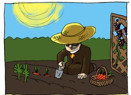

<br>

<div class = "row">

<div class = "col-md-6">

<div class="alert alert-dismissible alert-warning">
  <h2>
  <strong>
  ¡Objetivos de aprendizaje del escrito!
  </strong>
  </h2>
  <HR>
- 
- 

<div style='text-align:justify'><font color="black"><i class="fa fa-comments-o"></font></i> Si ves algo mal, <a href="mailto:jollopezma@unal.edu.co">¡hazmelo saber!</a> También estoy abierto a sugerencias.</div>

</div>

</div>

<div class = "col-md-6">

```{r Imagen, out.width = "38%", eval = TRUE, echo = FALSE, message = FALSE}
library(knitr)
include_graphics('Imagenes/Mendel.jpg')
```

</div>

</div>

<br>

<center>
<h1>
<strong>
<p class="text-primary">
Una introducción a la herencia</font>
</strong>
</h1>
</center>

<div style='text-align:justify'>Algunas vez te haz preguntado ¿por qué hay individuos que son muy parecidos entre sí? Tal vez este parecido es más evidente entre miembros de una misma familia. Por ejemplo, dos hermanos pueden compartir un color de cabello poco común (color rojo) o estar predispuestos a un trastorno o a una enfermedad. Estos rasgos pueden tener una <font color="black"><u>base genética</u></font>, lo que significa que dependen de la información genética que el individuo hereda de sus padres.

Sabiendo esto, ¿es posible descubrir cómo se transmite la información genética entre generaciones? Este escrito trata sobre los <font color="black"><u>principios de la herencia</u></font>, o cómo se transmiten los genes de generación en generación, lo cual permitirá dar respuesta a esta pregunta.

<br>

<h2>
<strong>
El monje en el jardín: Gregor Johann Mendel
</strong>
</h2>

Los principios de la herencia fueron expuestos por primera vez por un monje del siglo XIX llamado <font color="black"><u>Gregor Mendel</u></font>. Conocido como el padre de la genética, Mendel fue un maestro, aprendiz de por vida, científico y un hombre de fe.

<div class = "row">

<div class = "col-md-8">

En las huertas del monasterio donde residia (La abadía de Santo Tomás de Brno), llevo a cabo sus famosos experimientos con guisantes que le llevaron a proponer tiempo después lo que se conoceria como las <font color="black"><u>leyes de la herencia de Mendel</u></font>. Precisamente, el éxito de Mendel se debe a la elección de la planta de guisantes (*Pisum sativum*) como sujeto experimental.

</div>

<div class = "col-md-4">

```{r Imagen 2, out.width = "84%", eval = TRUE, echo = FALSE, message = FALSE}
library(knitr)

```

</div>

</div>

<div class = "row">

<div class = "col-md-9">

Si bien Mendel probó con otros organismos como ratones, abejas y plantas, eligió a los guisantes como su principal sistema modelo debido a las ventajas que estos ofrecian para la investigación genética. <!--Un <font color="black"><u>sistema modelo</u></font> es un organismo que facilita investigar una cuestión científica en particular, como por ejemplo, cómo se heredan las características. Al estudiar un sistema modelo, los investigadores pueden aprender principios generales que se aplican a otros organismos más difíciles de estudiar, como los humanos.--> Eran faciles de cultivar, y Mendel disponia tanto del jardín como del invernadero del monasterio. Los guisantes crecen relativamente rápido, completando una generación completa en una sola temporada de crecimiento.

</div>

<div class = "col-md-3">

```{r Imagen 3, out.width = "100%", eval = TRUE, echo = FALSE, message = FALSE}
library(knitr)
include_graphics('Imagenes/Mendel_3.jpg')
```

</div>

</div>

<div class = "row">

<div class = "col-md-8">

El logro de Mendel se puede atribuir también a los siete rasgos que eligió para su estudio. Evitó características que muestran un rango de variación; en cambio, centró su atención en las que existen en dos formas fácilmente diferenciadas, como las capas de semillas blancas versus las grises, las semillas redondas versus arrugadas y las vainas infladas versus las comprimidas.

</div>

<div class = "col-md-4">

```{r Gráfica en blanco de rasgos en guisantes, out.width = "100%", fig.align="center", fig.showtext = TRUE, echo = FALSE, eval = TRUE, message = FALSE}

library(ggplot2)
library(dplyr)
library(jpeg)
library(gridGraphics)
library(emojifont)
library(showtext) # Link donde hay varias fuentes de ejemplo (https://github.com/yixuan/showtext)
font_add_google('Gochi Hand', 'gochi')
showtext_auto()

Imagen_1 <- readJPEG('Imagenes/Guisantes.jpg', native = TRUE)
g1 <- rasterGrob(Imagen_1, interpolate = FALSE)

Guisantes <- data.frame(
  x = c(1:2.0), y = c(1:2.0)
) %>%
  ggplot(aes(x, y)) +
  geom_blank() +
  annotation_custom(g1, xmin = 1.2, xmax = 1.43, ymin = 1.2, ymax = 1.6) +
  geom_fontawesome('fa-circle', x = 1.48, y = 1.4005, size = 18.4, color = 'gray54') +
  geom_fontawesome('fa-circle', x = 1.54, y = 1.4005, size = 18.4, color = 'yellow') +
  annotate(geom = 'text', x = 1.725, y = 1.4005, label = 'Color de la semilla', family = 'gochi', size = 18.8, colour = 'black') +
  geom_fontawesome('fa-arrows-v', x = 1.48, y = 1.4, size = 32.4, color = 'black') +
  geom_fontawesome('fa-arrows-v', x = 1.54, y = 1.4, size = 22.4, color = 'black') +
  annotate(geom = 'text', x = 1.725, y = 1.4, label = 'Longitud del tallo', family = 'gochi', size = 18.8, colour = 'black') +
  scale_y_continuous(limits = c(1.399, 1.4012)) +
  scale_x_continuous(limits = c(1.18, 1.9)) +
  theme_void() +
  theme(axis.text = element_blank(),
        axis.ticks = element_blank(),
        axis.title = element_blank())
Guisantes
```

</div>

</div>

<div class = "row">

<div class = "col-md-9">

Finalmente, Mendel tuvo éxito porque adoptó un enfoque experimental: formuló hipótesis basadas en sus observaciones iniciales y luego realizó cruces adicionales para probar sus hipótesis. Mantuvo registros cuidadosos de los números de progenie que poseen cada tipo de rasgo y proporciones calculadas de los diferentes tipos. Prestó mucha atención a los detalles, fue paciente y minucioso, realizando sus experimentos durante 10 años antes de intentar escribir sus resultados.

</div>

<div class = "col-md-3">

```{r Imagen 4, out.width = "100%", eval = TRUE, echo = FALSE, message = FALSE}
library(knitr)
include_graphics('Imagenes/Mendel_4.jpg')
```

</div>

</div>

<!--
Los estudios de Mendel constituyen un excelente ejemplo de buena técnica científica. Eligió el material de investigación adecuado para el estudio del problema en cuestión, diseñó sus experimentos cuidadosamente, recopiló grandes cantidades de datos y utilizó análisis matemáticos para mostrar que los resultados eran consistentes con su hipótesis. Las predicciones de la hipótesis se probaron en una nueva ronda de experimentación.
-->

<br>

<h2>
<strong>
Investigación sobre la herencia
</strong>
</h2>
</p>

<br>

<H4 align="center"> Copyright &copy; 2019, página web hecha con Rmarkdown. </H4>
