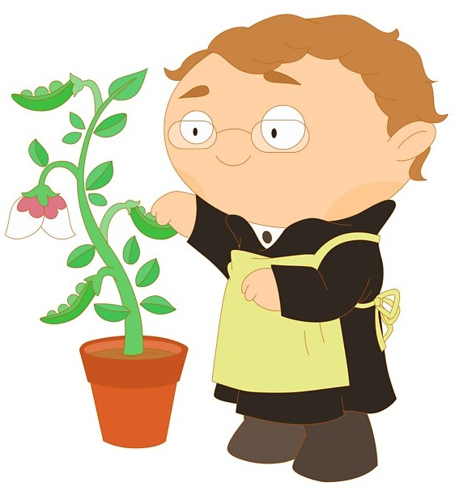

```{r Paquetes usados, echo = FALSE, eval = TRUE, message = FALSE}

library(ggplot2)
library(dplyr)
library(jpeg)
library(gridGraphics)
library(emojifont)
library(showtext) # Link donde hay varias fuentes de ejemplo (https://github.com/yixuan/showtext)
font_add_google('Gochi Hand', 'gochi')
font_add_google('Lobster', 'lobster')
showtext_auto()
```


<br>

<div class = "row">

<div class = "col-md-6">

<div class="card border-dark mb-3" style="max-width: 40rem;">
  <div class="card-header">
  <strong>
  ¡Objetivos de aprendizaje del escrito!
  <HR>
  </strong>
  <p class="card-text">
- 
-
  </p>
  </div>
  </div>
  <div style='text-align:justify'><font color="black"><i class="fa fa-comments-o"></font></i> Si ves algo mal, <a href="mailto:jollopezma@unal.edu.co">¡hazmelo saber!</a> También estoy abierto a sugerencias.</div>

</div>


<div class = "col-md-6">

```{r Imagen, out.width = "38%", eval = TRUE, echo = FALSE, message = FALSE}
library(knitr)

```

</div>

</div>

<br>

<center>
<h1>
<strong>
<p class="text-primary">
Una introducción a la herencia</font>
</strong>
</h1>
</center>

<div style='text-align:justify'>Algunas vez te haz preguntado ¿por qué hay individuos que son muy parecidos entre sí? Tal vez este parecido es más evidente entre miembros de una misma familia. Por ejemplo, dos hermanos pueden compartir un color de cabello poco común (color rojo) o estar predispuestos a un trastorno o a una enfermedad. Estos caracteres pueden tener una <font color="black"><u>base genética</u></font>, lo que significa que dependen de la información genética que el individuo hereda de sus padres.

Sabiendo esto, ¿es posible descubrir cómo se transmite la información genética entre generaciones? Este escrito trata sobre los <font color="black"><u>principios de la herencia</u></font>, o cómo se transmiten los genes de generación en generación, lo cual permitirá dar respuesta a esta pregunta.

<br>

<h2>
<strong>
El monje en el jardín: Gregor Johann Mendel
</strong>
</h2>

Los principios de la herencia fueron expuestos por primera vez por un monje del siglo XIX llamado <font color="black"><u>Gregor Mendel</u></font>. Conocido como el padre de la genética, Mendel fue un maestro, aprendiz de por vida, científico y un hombre de fe.

<div class = "row">

<div class = "col-md-8">

En las huertas del monasterio donde residia (La abadía de Santo Tomás de Brno), llevo a cabo sus famosos experimientos con guisantes que le llevaron a proponer tiempo después lo que se conoceria como las <font color="black"><u>leyes de la herencia de Mendel</u></font>. Precisamente, el éxito de Mendel se debe a la elección de la planta de guisantes (*Pisum sativum*) como sujeto experimental.

</div>

<div class = "col-md-4">

```{r Imagen 2, out.width = "84%", eval = TRUE, echo = FALSE, message = FALSE}
library(knitr)
include_graphics('Imagenes/Mendel_2.jpg')
```

</div>

</div>

<div class = "row">

<div class = "col-md-9">

Si bien Mendel probó con otros organismos como ratones, abejas y plantas, eligió a los guisantes como su principal sistema modelo debido a las ventajas que estos ofrecian para la investigación genética. <!--Un <font color="black"><u>sistema modelo</u></font> es un organismo que facilita investigar una cuestión científica en particular, como por ejemplo, cómo se heredan las características. Al estudiar un sistema modelo, los investigadores pueden aprender principios generales que se aplican a otros organismos más difíciles de estudiar, como los humanos.--> Eran faciles de cultivar, y Mendel disponia tanto del jardín como del invernadero del monasterio. Los guisantes crecen relativamente rápido, completando una generación completa en una sola temporada de crecimiento.

</div>

<div class = "col-md-3">

```{r Imagen 3, out.width = "100%", eval = TRUE, echo = FALSE, message = FALSE}
library(knitr)
include_graphics('Imagenes/Mendel_3.jpg')
```

</div>

</div>

<div class = "row">

<div class = "col-md-8">

El logro de Mendel se puede atribuir también a los siete caracteres que eligió para su estudio. Evitó características que muestran un rango de variación; en cambio, centró su atención en las que existen en dos formas fácilmente diferenciadas, como el color de la flor blanca versus las violetas, las semillas redondas versus arrugadas y las vainas infladas versus las comprimidas.

</div>

<div class = "col-md-4">

```{r Gráfica en blanco de rasgos en guisantes, out.width = "100%", fig.align="center", fig.showtext = TRUE, echo = FALSE, eval = TRUE, message = FALSE}

Imagen_1 <- readJPEG('Imagenes/Guisantes.jpg', native = TRUE)
g1 <- rasterGrob(Imagen_1, interpolate = FALSE)

Guisantes <- data.frame(
  x = c(1:2.0), y = c(1:2.0)
) %>%
  ggplot(aes(x, y)) +
  geom_blank() +
  annotation_custom(g1, xmin = 1.2, xmax = 1.43, ymin = 1.2, ymax = 1.6) +
  geom_fontawesome('fa-leaf', x = 1.48, y = 1.4005, size = 24.4, color = 'gray') +
  geom_fontawesome('fa-leaf', x = 1.54, y = 1.4005, size = 24.4, color = 'purple') +
  annotate(geom = 'text', x = 1.725, y = 1.4005, label = 'Color de la flor', family = 'gochi', size = 18.8, colour = 'black') +
  geom_fontawesome('fa-arrows-v', x = 1.48, y = 1.4, size = 32.4, color = 'black') +
  geom_fontawesome('fa-arrows-v', x = 1.54, y = 1.4, size = 22.4, color = 'black') +
  annotate(geom = 'text', x = 1.725, y = 1.4, label = 'Longitud del tallo', family = 'gochi', size = 18.8, colour = 'black') +
  scale_y_continuous(limits = c(1.399, 1.4012)) +
  scale_x_continuous(limits = c(1.18, 1.9)) +
  theme_void() +
  theme(axis.text = element_blank(),
        axis.ticks = element_blank(),
        axis.title = element_blank())
Guisantes
```

</div>

</div>

<div class = "row">

<div class = "col-md-9">

Finalmente, Mendel tuvo éxito porque adoptó un enfoque experimental: formuló hipótesis basadas en sus observaciones iniciales y luego realizó cruces adicionales para probar sus hipótesis. Mantuvo registros cuidadosos de los números de progenie que poseen cada tipo de carácter y proporciones calculadas de los diferentes tipos. Prestó mucha atención a los detalles, fue paciente y minucioso, realizando sus experimentos durante 10 años antes de intentar escribir sus resultados.

</div>

<div class = "col-md-3">

```{r Imagen 4, out.width = "100%", eval = TRUE, echo = FALSE, message = FALSE}
library(knitr)

```

</div>

</div>

<!--
Los estudios de Mendel constituyen un excelente ejemplo de buena técnica científica. Eligió el material de investigación adecuado para el estudio del problema en cuestión, diseñó sus experimentos cuidadosamente, recopiló grandes cantidades de datos y utilizó análisis matemáticos para mostrar que los resultados eran consistentes con su hipótesis. Las predicciones de la hipótesis se probaron en una nueva ronda de experimentación.
-->

<br>

<h2>
<strong>
Investigación sobre la herencia
</strong>
</h2>
</p>

Antes de examinar los cruces de Mendel y las conclusiones que sacó de ellos, será útil revisar algunos términos comúnmente utilizados en genética:

<div class = "row">

<div class = "col-md-4">

<div class="alert alert-dismissible alert-warning">
  <h2 class="alert-heading">
  <strong>
  Carácter
  </strong>
  </h2>
  <HR>
  <p class="mb-0">La palabra <font color="black"><u>carácter</font></u> significa una propiedad específica de un organismo; los genetistas usan este término como sinónimo de característica o rasgo.</p>
</div>

</div>

<div class = "col-md-4">

<div class="alert alert-dismissible alert-danger">
  <h2 class="alert-heading">
  <strong>
  Gen
  </strong>
  </h2>
  <HR>
  <p class="mb-0">En el contexto de cruces genéticos, se define un <font color="black"><u>gen</font></u> como un factor heredado que determina un carácter.</p>
</div>

</div>

<div class = "col-md-4">

<div class="alert alert-dismissible alert-info">
 <h2 class="alert-heading">
  <strong>
  Alelo
  </strong>
  </h2>
  <HR>
  <p class="mb-0">Una de dos o más formas alternativas de un gen. Por ejemplo, en los cruces de Mendel, el color de la flor fue determinada por un gen que existe como dos <font color="black"><u>alelos</font></u> diferentes.</p>
</div>

</div>

</div>

<div class = "row">

<div class = "col-md-4">

<div class="alert alert-dismissible alert-primary">
  <h2 class="alert-heading">
  <strong>
  Locus
  </strong>
  </h2>
  <HR>
  <p class="mb-0">Lugar específico en un cromosoma ocupado por un alelo. Por lo tanto, hay un lugar específico, un <font color="black"><u>locus</font></u>, en un cromosoma en las plantas de guisantes donde se determina el color de la flor.</p>
</div>

</div>

<div class = "col-md-4">

<div class="alert alert-dismissible alert-success">
  <h2 class="alert-heading">
  <strong>
  Genotipo
  </strong>
  </h2>
  <HR>
  <p class="mb-0">El <font color="black"><u>genotipo</font></u> es el conjunto de alelos que posee un organismo individual. Un organismo diploide que posee dos alelos idénticos es homocigoto. Uno que posee dos alelos distintos es heterocigoto.</p>
</div>

</div>

<div class = "col-md-4">

<div class="alert alert-dismissible alert-warning">
  <h2 class="alert-heading">
  <strong>
  Fenotipo
  </strong>
  </h2>
  <HR>
  <p class="mb-0">El <font color="black"><u>fenotipo</font></u> es la manifestación o aparición de una característica. Un fenotipo puede referirse a cualquier tipo de característica: física, fisiológica, bioquímica o conductual.</p>
</div>

</div>

</div>

<HR>

Tambíen observemos la siguiente figura y su interpretación:

<div class = "row">

<div class = "col-md-6">


</div>

<div class = "col-md-6">

```{r Grafo conceptual de la genética mendeliana 2, out.width = "100%", fig.align="center", echo = FALSE, eval = TRUE, fig.showtext = TRUE}

Grafo_GM_2 <- data.frame(
  x = c(1:8), y = c(1:8)
) %>%
  ggplot(aes(x, y)) +
  geom_blank() +
  geom_fontawesome('fa-arrows-v', x = 1.8, y = 1.2, size = 14.4, color = 'black') +
  geom_fontawesome('fa-arrows-v', x = 1.98, y = 1.2, size = 11.4, color = 'black') +
  annotate(geom = 'segment', x = 2.1, xend = 2.1, y = 1.0, yend = 1.4, colour = 'black', size = 1.0) +
  geom_fontawesome('fa-leaf', x = 2.22, y = 1.1, size = 9.2, color = 'gray') +
  geom_fontawesome('fa-leaf', x = 2.22, y = 1.3, size = 9.2, color = 'purple') +
  annotate(geom = 'text', x = 3.3, y = 1.2, label = 'Tipos de características', family = 'gochi', size = 9.8, colour = 'black') +
  geom_curve(x = 2.2, xend = 2.2, y = 1.5, yend = 2.0, arrow = arrow(length = unit(0.1, 'inch')), size = 1.0, color = 'black', curvature = 0.0) +
  geom_fontawesome('fa-leaf', x = 1.9, y = 2.2, size = 9.2, color = 'purple') +
  geom_fontawesome('fa-arrows-v', x = 2.1, y = 2.2, size = 11.4, color = 'black') +
  annotate(geom = 'text', x = 2.8, y = 2.24, label = 'Fenotipos', family = 'gochi', size = 9.8, colour = 'black') +
  annotate(geom = 'text', x = 1.78, y = 2.16, label = '(', family = 'gochi', size = 12.4, colour = 'black') +
  annotate(geom = 'text', x = 2.24, y = 2.16, label = ')', family = 'gochi', size = 12.4, colour = 'black') +
   annotate(geom = 'text', x = 2.0, y = 2.16, label = ',', family = 'gochi', size = 12.4, colour = 'black') +
  geom_curve(x = 2.2, xend = 2.2, y = 2.9, yend = 2.4, arrow = arrow(length = unit(0.1, 'inch')), size = 1.0, color = 'black', curvature = 0.0) +
  annotation_custom(g1, xmin = 1.7, xmax = 2.3, ymin = 3.0, ymax = 4.0) +
  annotation_custom(g1, xmin = 2.15, xmax = 2.75, ymin = 3.0, ymax = 4.4) +
  annotate(geom = 'text', x = 3.2, y = 2.84, label = 'Individuos adultos', family = 'gochi', size = 9.8, colour = 'black') +
  geom_fontawesome('fa-mars', x = 1.2, y = 4.4, size = 12.4, color = 'black') +
  geom_fontawesome('fa-venus', x = 1.42, y = 5.4, size = 12.4, color = 'black') +
  geom_curve(x = 1.8, xend = 1.2, y = 3.5, yend = 4.15, arrow = arrow(length = unit(0.1, 'inch')), size = 1.0, color = 'black', curvature = -0.5)  +
  geom_curve(x = 1.8, xend = 1.4, y = 3.8, yend = 5.1, arrow = arrow(length = unit(0.1, 'inch')), size = 1.0, color = 'black', curvature = -0.4) +
  annotate(geom = 'text', x = 1.2, y = 3.4, label = 'Gametogénesis', family = 'gochi', size = 8.2, colour = 'black') +
  annotate(geom = 'text', x = 1.8, y = 4.4, label = 'Ovogénesis', family = 'gochi', size = 8.2, colour = 'black') +
  annotate(geom = 'segment', x = 1.2, xend = 1.3, y = 5.0, yend = 6.0, colour = 'black', size = 1.0) +
  geom_curve(x = 1.3, xend = 3.3, y = 6.0, yend = 5.8, arrow = arrow(length = unit(0.1, 'inch')), size = 1.0, color = 'black', curvature = -0.5) +
  annotate(geom = 'text', x = 3.3, y = 5.6, label = 'Fecundación', family = 'gochi', size = 9.8, colour = 'black') +
  geom_curve(x = 3.4, xend = 3.5, y = 5.4, yend = 4.7, arrow = arrow(length = unit(0.1, 'inch')), size = 1.0, color = 'black', curvature = -0.2) +
  geom_fontawesome('fa-circle', x = 3.5, y = 4.5, size = 9.4, color = 'gray34') +
  annotate(geom = 'text', x = 3.9, y = 4.5, label = 'Cigoto', family = 'gochi', size = 9.8, colour = 'black') +
  geom_curve(x = 3.5, xend = 2.7, y = 4.3, yend = 3.6, arrow = arrow(length = unit(0.1, 'inch')), size = 1.0, color = 'black', curvature = -0.4) +
  annotate(geom = 'text', x = 3.5, y = 3.6, label = 'Ontogénesis', family = 'gochi', size = 8.2, colour = 'black') +
  annotate(geom = 'text', x = 5.8, y = 1.8, label = 'A', family = 'lobster', size = 8.8, colour = 'black') +
  annotate(geom = 'text', x = 5.9, y = 1.8, label = 'a', family = 'lobster', size = 8.8, colour = 'black') +
  annotate(geom = 'segment', x = 6.0, xend = 6.0, y = 1.6, yend = 2.0, colour = 'black', size = 1.0) +
  annotate(geom = 'text', x = 6.1, y = 1.8, label = 'B', family = 'lobster', size = 8.8, colour = 'black') +
  annotate(geom = 'text', x = 6.2, y = 1.8, label = 'b', family = 'lobster', size = 8.8, colour = 'black') +
  annotate(geom = 'text', x = 6.9, y = 1.8, label = 'Tipos de genes', family = 'gochi', size = 9.8, colour = 'black') +
  geom_curve(x = 6.2, xend = 6.2, y = 2.1, yend = 2.8, arrow = arrow(length = unit(0.1, 'inch')), size = 1.0, color = 'black', curvature = 0.0) +
  annotate(geom = 'text', x = 6.1, y = 3.0, label = 'ab', family = 'lobster', size = 8.8, colour = 'black') +
  annotate(geom = 'text', x = 5.8, y = 3.0, label = 'aB', family = 'lobster', size = 8.8, colour = 'black') +
  annotate(geom = 'text', x = 6.1, y = 3.4, label = 'Ab', family = 'lobster', size = 8.8, colour = 'black') +
  annotate(geom = 'text', x = 5.8, y = 3.4, label = 'AB', family = 'lobster', size = 8.8, colour = 'black') +
  annotate(geom = 'text', x = 6.6, y = 3.1, label = 'Genotipos', family = 'gochi', size = 9.8, colour = 'black') +
  annotate(geom = 'text', x = 5.0, y = 4.5, label = 'Segregación', family = 'gochi', size = 9.8, colour = 'black') +
  geom_curve(x = 5.58, xend = 5.0, y = 3.2, yend = 4.3, arrow = arrow(length = unit(0.1, 'inch')), size = 1.0, color = 'black', curvature = -0.4) +
  annotate(geom = 'text', x = 5.9, y = 6.3, label = 'A', family = 'lobster', size = 8.8, colour = 'black') +
  annotate(geom = 'text', x = 6.0, y = 6.3, label = ',', family = 'lobster', size = 8.8, colour = 'black') +
  annotate(geom = 'text', x = 6.1, y = 6.3, label = 'B', family = 'lobster', size = 8.8, colour = 'black') +
  annotate(geom = 'text', x = 6.8, y = 6.6, label = 'Genotipos haploides', family = 'gochi', size = 9.8, colour = 'black') +
  geom_curve(x = 5.0, xend = 5.7, y = 4.7, yend = 6.1, arrow = arrow(length = unit(0.1, 'inch')), size = 1.0, color = 'black', curvature = -0.4) +
  annotate(geom = 'text', x = 7.0, y = 4.5, label = 'Recombinación', family = 'gochi', size = 9.8, colour = 'black') +
  geom_curve(x = 6.2, xend = 7.0, y = 6.1, yend = 4.7, arrow = arrow(length = unit(0.1, 'inch')), size = 1.0, color = 'black', curvature = -0.4) +
  geom_curve(x = 7.0, xend = 6.3, y = 4.3, yend = 3.4, arrow = arrow(length = unit(0.1, 'inch')), size = 1.0, color = 'black', curvature = -0.4) +
  scale_y_continuous(limits = c(1.0, 6.6)) +
  scale_x_continuous(limits = c(1.0, 7.3)) +
  theme_void() +
  theme(axis.text = element_blank(),
        axis.ticks = element_blank(),
        axis.title = element_blank())
Grafo_GM_2
```

</div>

</div>

<br>

<H4 align="center"> Copyright &copy; 2019, página web hecha con Rmarkdown. </H4>
