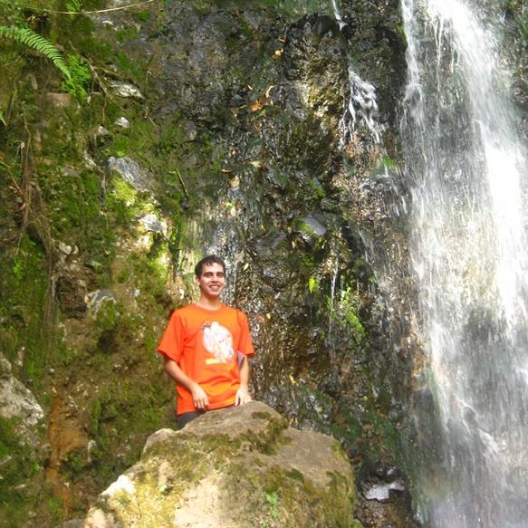

<div class = "row">

<div class = "col-md-6">

<div class="alert alert-dismissible alert-info">
  <button type="button" class="close" data-dismiss="alert">&times;</button>
  <strong>¡Hola! Mi nombre es Jorge Leonardo López Martínez, aunque mis amigos me suelen decir Leo <i class="far fa-smile-beam"></i>. Gracias por visitar mi sitio web personal. Mis intereses son la genética, la bioestadística, y la programación. <a href="Documentos/CV.pdf" class="download" title="Aquí" target="_blank"> Aquí </a> podrás encontrar más información sobre mi trayectoria.</strong>
</div>

<div class="alert alert-dismissible alert-danger">
  <button type="button" class="close" data-dismiss="alert">&times;</button>
  <strong>Por favor, si tienes interés en comunicarte conmigo, **¡hazlo!**. Prontamente me comunicare contigo para ver en que te puedo ayudar.</strong>
</div>

<div class="alert alert-dismissible alert-warning">
  <button type="button" class="close" data-dismiss="alert">&times;</button>
  <strong>Mi correo es: jollopezma@unal.edu.co</strong>
</div>

</div>

<div class = "col-md-6">
```{r Imagen, eval = TRUE, echo = FALSE, message = FALSE}
library(knitr)

```
</div>
</div>

<div class="alert alert-dismissible alert-success">
  <button type="button" class="close" data-dismiss="alert">&times;</button>
  <strong>En la línea de tiempo a continuación podrás ver un resumen de mi formación académica <i class="fas fa-graduation-cap"></i></strong>
</div>

```{r Mi línea de tiempo, eval = TRUE, echo = FALSE, message = FALSE}
library(VisualResume)

VisualResume(titles.left = '',
             titles.right = '',
             timeline = data.frame(title = c('', '', '', ''),
                                   sub = c('Primaria y bachillerato en el\n Colegio La Salle', 'Zootecnia en la\n Universidad Nacional', 'Maestria en Ciencias Agrarias\n Universidad Nacional', 'Trabajo de independiente'),
                                   start = c(1995, 2007, 2015, 2017),
                                   end = c(2006, 2014, 2018, 2021),
                                   side = c(1, 1, 0, 1)),
             milestones = data.frame(title = '',
                                     sub = '',
                                     year = c(2006, 2014, 2018)),
             events = data.frame(year = 2018,
                                 title = 'Modelación y estimación de parámetros genéticos\n en vacas criollas colombianas.'),
             interests = list('Programación' = c(rep('R', 10), 'Python'),
                              'Bioestadística' = c(rep("Estadística multivariada", 10), rep('Diseño experimental', 5), rep('Regresión', 3)),
                              'Genética' = c(rep('Genética poblacional', 10), rep('Genética cuantitativa', 5))),
             year.steps = 2
)
```
