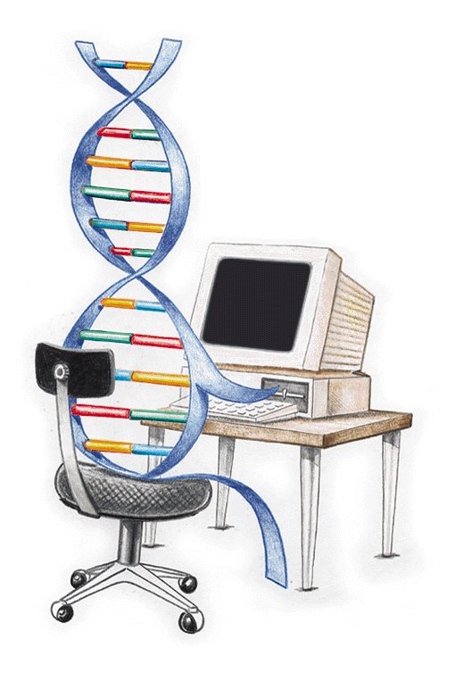

<center>
<h2>**¡Bienvenido a mi sitio web personal!**</h1>
</center>

<br>
<br>

```{r Imagen, fig.asp=0.25, out.width = '240px', fig.align = 'center', eval = TRUE, echo = FALSE, message = FALSE}
library(knitr)

```

